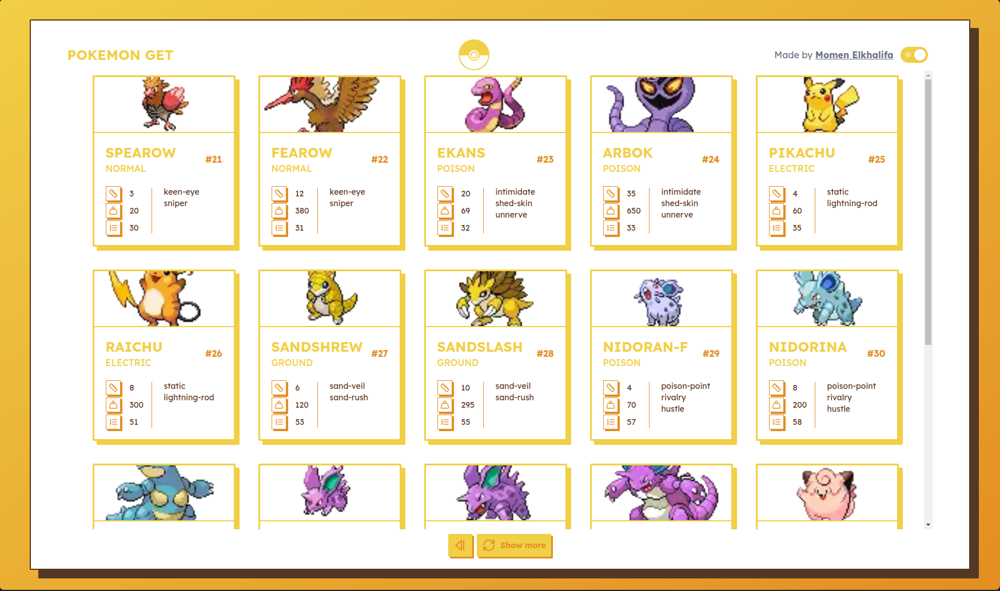
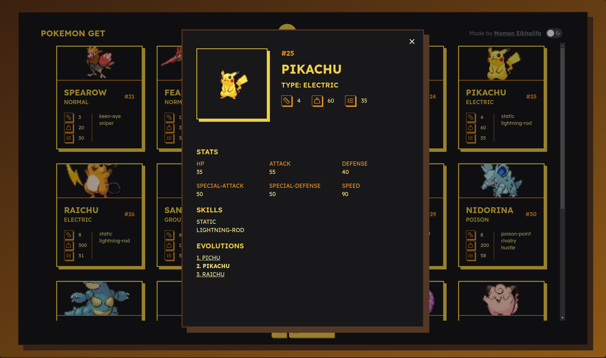

# POKEMON GET

## [2024 CodeStacker](https://github.com/rihal-om/rihal-codestacker/tree/main) FE challenge submission

A website that utilize https://pokeapi.co/ API to fetch 20 pokemons info on each page and you can view more details about the pokemon by clicking on it.
All the API logic can be found in `utils/pokemons.service.ts`

### Screenshots

### Tools used

1. NextJS 14.
2. NextUI component library.
3. Typescript.
4. Pokedex promise v2.
5. Bun

### Features

1. Mobile responsive.
2. Dark mode support.
3. Neo-brutalism design.
4. Request caching.
5. Suspense boundaries.

### Live preview:

### Install using Docker

1. Clone the repo.
2. Run `docker build --pull -t pokemon-get .`
3. Run `docker run -d -p 3000:3000 pokemon-get`

### Install and run manually

1. Clone the repo.
2. Run `bun install` to install the dependencies.
3. Run `bun dev` to start the server and open `localhost:3000`

### What I learned

1. Intercepting and parrellal routes.
2. Dark mode support using `next-themes`

### TODO

1. Implement testing.
2. Add more animations to components.
